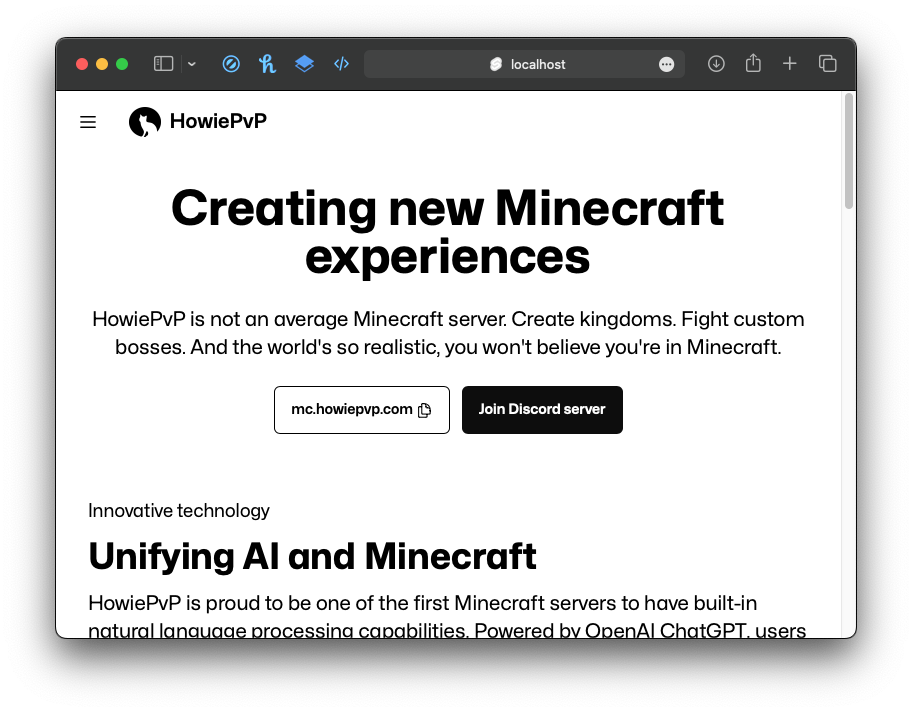

# HowiePvP Website

Official website for the HowiePvP Minecraft server, built with SvelteKit and daisyUI



## Configuration

This app uses environment variables for configuration. Copy the `.env.example` file in
the root directory, rename it to ".env", and change the values if needed.

## Developing

Install dependencies with Yarn, then run:

```bash
yarn dev
```

## Building

To create a production version of the site:

```bash
yarn build
```

You can preview the production build with `yarn preview`.
